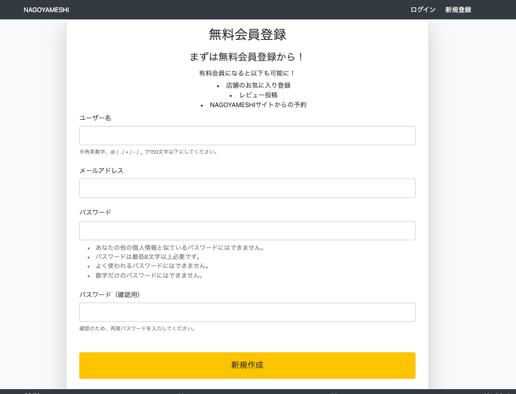
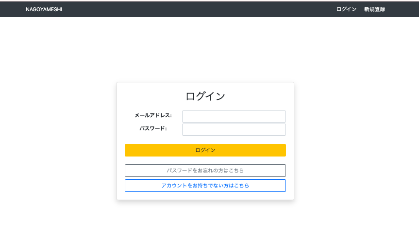
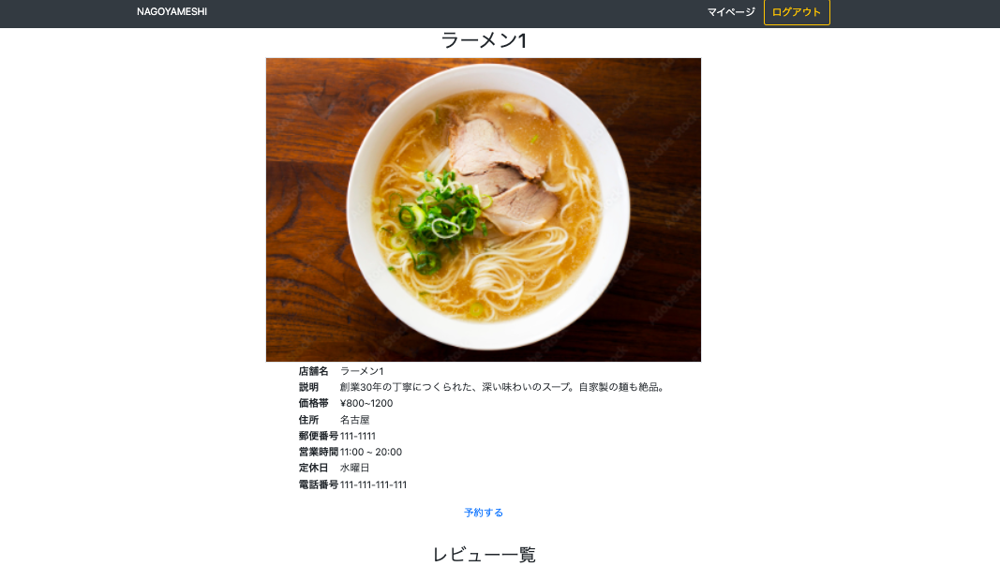
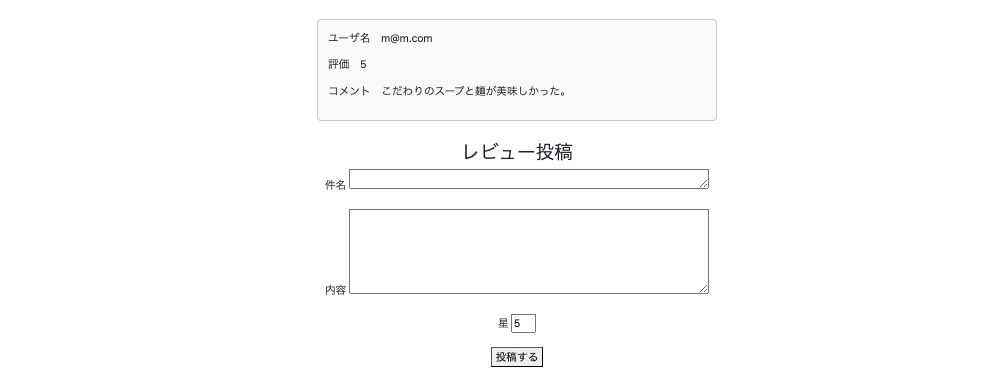
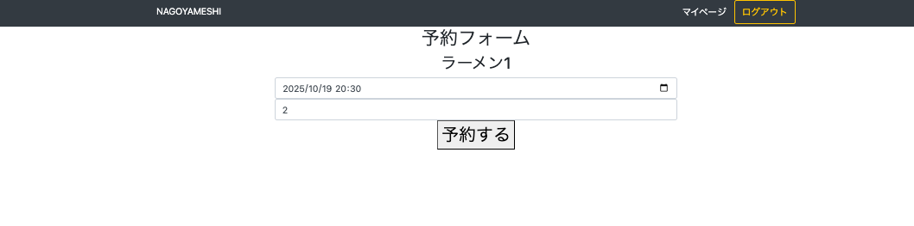
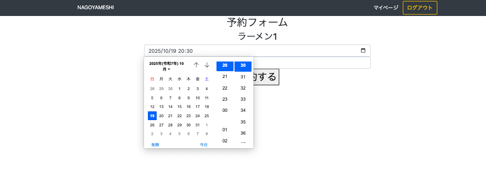

# Nagoyameshi 
名古屋のグルメをまとめたレビューサイト（食べログ風アプリ）

## 概要
本アプリはプログラミングスクールの課題を基に、  
学習終了後も自主的に機能を拡張して開発を継続しているWebアプリです。  

AWSエンジニアとしてのコーディング理解や開発基盤の理解を深める目的で、  
バックエンド開発をPython（Django）を用いて実装しました。

## 使用技術
- Python / Django
- MySQL
- HTML / CSS 

## 主な機能
- 会員登録登録
- ログイン機能
- 店舗検索・店舗詳細情報表示機能
- 店舗予約機能

## アプリケーションの画面
以下は、アプリケーションの各画面のスクリーンショットです。

### 会員登録画面とログイン画面
新規登録ボタンからユーザ名、メールアドレス、パスワードを入力することで会員登録を行う。
会員登録後はログインボタンからログイン可能。

### 店舗検索機能
トップページの検索ボックスに店舗名を入れて検索ボタンを押し、店舗名をクリックすると
店舗の詳細が表示される。
下にスクロールすると店舗のレビューも確認できる。

### 店舗予約機能
予約するボタンをクリックすると、予約フォームに飛び、日時と人数で予約を行う。
日時はカレンダーボタンからカレンダーを表示し、予約日時を入力可能。

## 今後の改善点
- お気に入り登録機能の追加
- Stripeを使った有料会員登録機能の追加（クレジットカードの登録必須）
- レビュー投稿、お気に入り、予約に有料会員かを判定する機能を追加
- HTML/CSSによるデザイン強化
