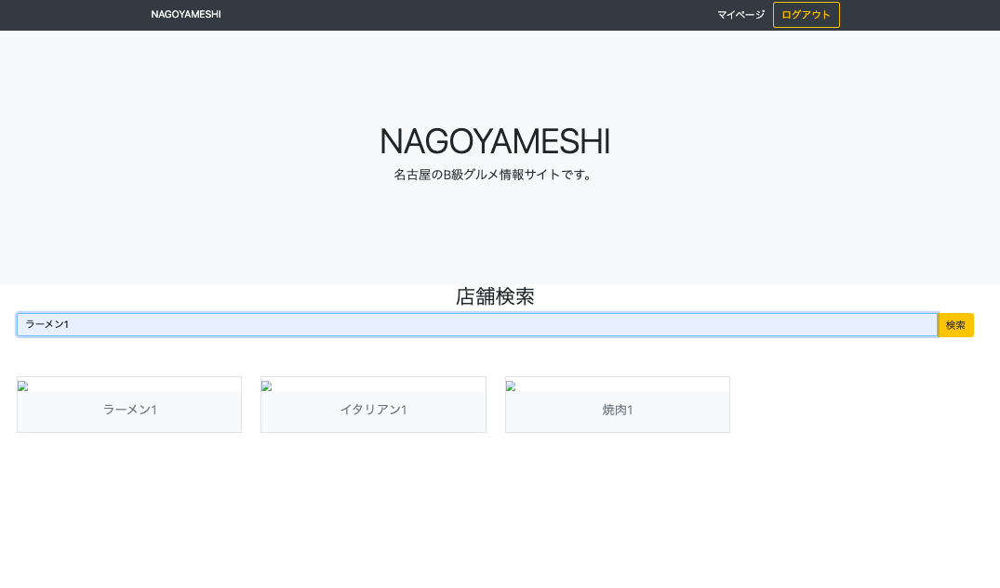

# Nagoyameshi 
名古屋のグルメをまとめたレビューサイト（食べログ風アプリ）

## 概要
本アプリはプログラミングスクールの課題を基に、  
学習終了後に自主的に機能を拡張して開発を継続しているWebアプリです。  

AWSエンジニアとしての業務理解を深める目的で、  
バックエンド開発・データベース設計・有料会員機能の実装などを試行しています。

## 使用技術
- Python / Django
- MySQL
- HTML / CSS 

## 主な機能
- 会員登録登録
- ログイン機能
- 店舗一覧・詳細ページ
- 店舗検索・店舗詳細情報表示機能
- レビュー登録機能

# アプリケーションの画面
以下は、アプリケーションの各画面のスクリーンショットです。

## トップページ

## 今後の改善点
- お気に入り登録機能の追加
- Stripeを使った有料会員登録機能の追加

